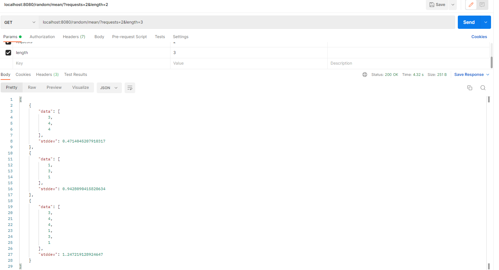

# golang_recruitment_task

As it was written in backend.md:
GET: /random/mean/?requests={r}&length={l}

In examples, there was:
{
     "stddev": 1,
     "data": [1, 2, 3, 4, 5]
}
but standard deviation of [1,2,3,4,5] is $\sqrt{2}$, so in my app this will be the result.

It was not specified from what range the numbers should be taken from, so I set it to from 1 to 6 to make the results easy to interpret.

There is sleep(3 seconds) function, for testing concurrency, it can be get rid of later.

#### To run docker: 
docker build -t rest_api . 

docker run -d -p 8080:8080 rest_api

The solution using gin_gonic is on the __main__ branch, the previous solution using __gorrilla_mux__ is on the gorilla branch.
